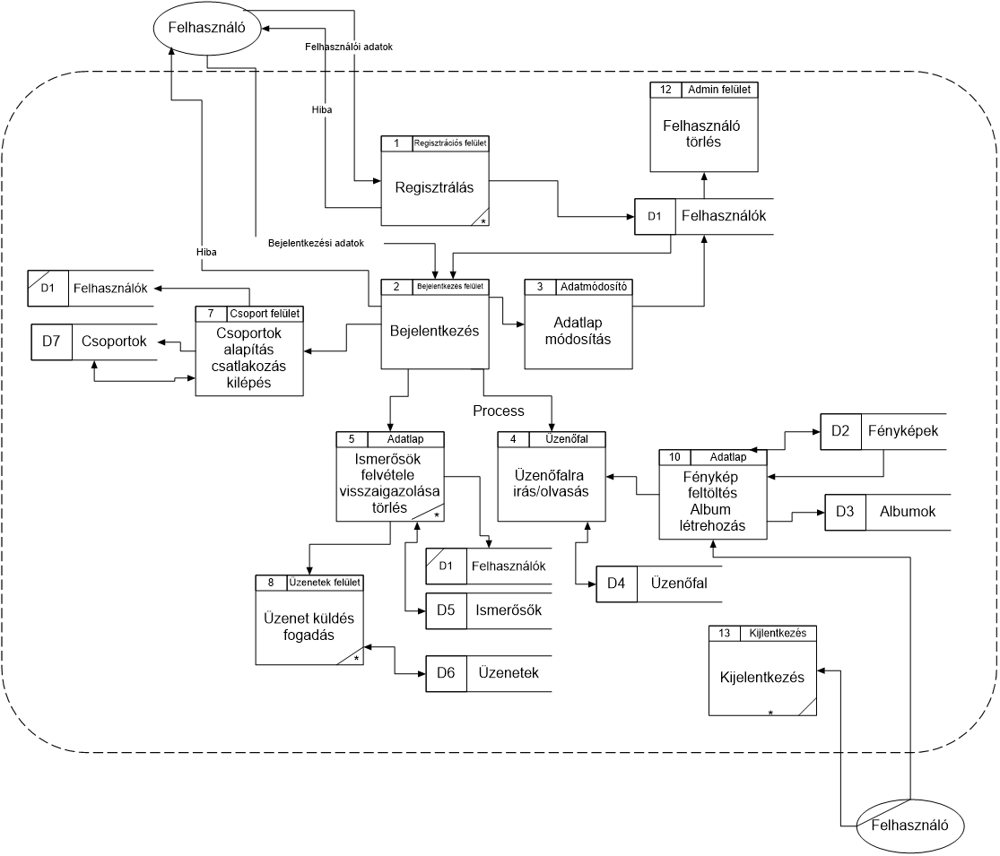
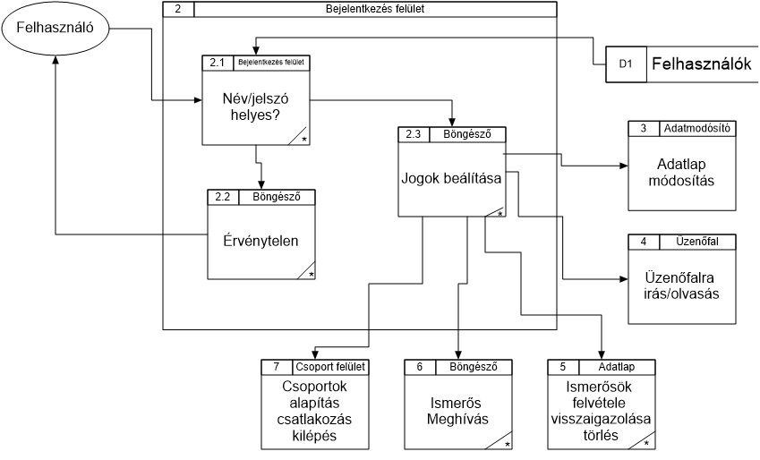
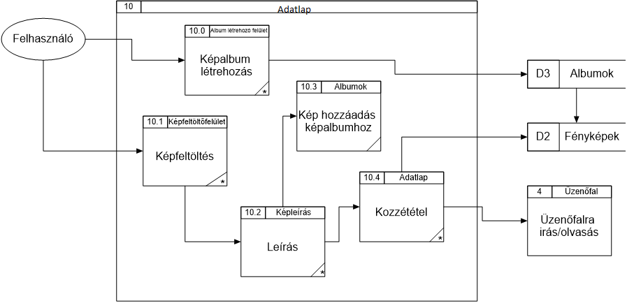
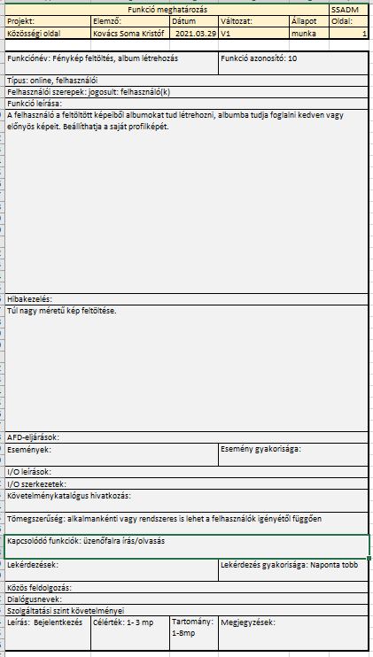
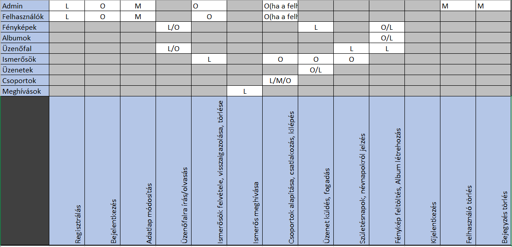
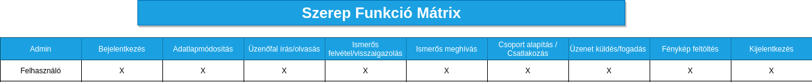

# `KÖZÖSSÉGI OLDAL` Projektterv 2021

## 1. Összefoglaló 
A projektünk témája egy közösségi oldal elkészítése, ahol az emberek a mindennapi életük fontosabb pontjait tudják megosztani ismerőseikkel, barátaikkal. Figyelemmel tudják követni egymás tevékenységeit, akár ezzel kapcsolatos reakcióikat is kifejezhetik, vagy éppen társaloghatnak is egymással. Célja, hogy megkönnyítse az embereknek a távolabbi ismerőseik elérését, ugyanakkor, hogy megerősítse a közelebbi barátaikkal lévő kapcsolatukat. A mai világban egy-egy hír, kifejezetten nagy jelentőséggel bír, amihez elengedhetetlen, egy hasonló oldal, ami képes felvenni a versenyt ezzel a száguldó társadalommal.

## 2. A projekt bemutatása
Ez a projektterv a `KÖZÖSSÉGI OLDAL` projektet mutatja be, mely 2021-02-16-tól 2021-05-07-ig tart. A projektet egy 3 fős csapat keretein belül kell elkészítenünk, amit a megrendelő felé 3 alkalman keresztül kell bemutatnunk és elkészítenünk.

### 2.1. Rendszerspecifikáció

### 2.1.1 Funkcionális követelmények
- Felhasználók regisztrálása, profilok létrehozása
- Fényképek feltöltése, megjegyzés hozzáfűzése
- Ismerősök bejelölése, ismeretség visszaigazolása
- Üzenet küldése ismerősöknek
- Klubok, csoportok alapítása
- Klubok tagjainak létszáma
- Ismeretlen tagok ajánlása ismerősnek közös ismerősök alapján
- Névnaposok, születésnaposok az adott hónapban
- Klubok ajánlása, ahol van közös ismerős
- Ismerősök ajánlása munkahely, vagy iskola alapján
- Üzenetek küldése, fogadása
- Üzenetek kiírása üzenőfalra, válaszolás üzenőfalra írt üzenetre
- Fényképalbumok létrehozása, albumjellemzők (fényképek száma, felhasznált tárhely)
- Meghívások kezelése, statisztika a meghívásokról (kinek hány olyan ismerőse van, akit ő hívott meg) 

### 2.1.2 Nem funkcionális követelmények
- Támogatott böngészők: Chrome, Opera, Firefox, Brave, Edge. (legfrissebb verzió)
- Adatbázis válaszidő kevesebb mint 300ms.
- AJAX frissítés.

## 3. Szervezeti felépítés és felelősségmegosztás
A projekt megrendelője Körmöczi László Ádám. A `KÖZÖSSÉGI OLDAL` projektet a következő projektcsapat fogja végrehajtani:

### 3.1 Projektcsapat
A projekt a következő emberekből áll:

|                                            |         Név         |        E-mail cím      |
|:------------------------------------------:|:-------------------:|:---------------------: |
|                 Projekt tag                | Kovács Soma Kristóf |kovacssoma2000@gmail.com|
|                 Projekt tag                |Lublóváry György Máté| lubigyurma@gmail.com   |
|                 Projekt tag                |      Cseri Gábor    | cserigabi4@gmail.com   |

## 4. A munka feltételei
### 4.1. Munkakörnyezet
A projekt a következő munkaállomásokat fogja használni a munka során:
 - LENOVO LEGION Y530 (Intel i7-8750H, 16 GB RAM, NVIDIA GTX 1050 Ti, Windows 10 Pro) - VS CODE, PHPStorm, Docker, SQL Developer, XAMPP
 - Számítógép (Ryzen 7 3800, 16 GB RAM, NVIDIA GTX 1030, Linux) - VS CODE, PHPStorm, Docker, SQL Developer, XAMPP
 - MSI GF63 Thin 8SC(Intel i7-8750H, 8 GB RAM, MSI GTX 1650 , Windows 10) - VS CODE, PHPStorm, Docker, SQL Developer, XAMPP

## 5. A munka tartalma
### 5.1. Tervezett szoftverfolyamat modell és architektúra
A csapat a SCRUM Model-lel tervezi a munkafolyamatokat megvalósítani. A projekt logikai szinten PHP-ban az MVC modellt követve fog elkészülni, amihez a GUI-t HTML/CSS/Javascript-tel fogjuk elkészíteni, és Oracle adatbázist fogunk használni.

### 5.2. Átadandók és határidők
A főbb átadandók és határidők a projekt időtartama alatt a következők:

D - dokumentáció, P - prototíus

| Szállítandó |                           Neve                           |   Határideje  |
|:-----------:|:--------------------------------------------------------:|:-------------:|
|      D1     |        Dokumentáció és adatbázisterv bemutatása          |   2021-03-30  |
|      D2     |        Adatbázist létrehozó szkriptek bemutatása         |   2021-04-11  |
|    P1+D3    |   Adatlekérés bemutatása grafikus felhasználói felületen |   2021-04-27  |
|    P2+D4    |  Adatfelvitel bemutatása grafikus felhasználói felületen |   2021-05-04  |
|    P3+D5    |                      Projektátadás                       |   2021-05-07  |

## 6. Feladatlista

A `KÖZÖSSÉGI OLDAL projekt 2021. február 16-án` indult. A következőkben a tervezett feladatok részletes összefoglalása található:

### 6.1. Dokumentáció (1. mérföldkő)
Ennek a feladatnak az a célja, hogy bemutassa a dokumentációt és a hozzájuk tartozó adatbázisterveket.

#### 6.1.1. Logikai adatfolyam diagram 1.szintű

#### 6.1.1.1 Logikai adatfolyam diagram 2.szintű

#### 6.1.2. Fizikai adatfolyam diagram (1. és 2. szintű)

#### 6.1.3. Egyedmodell

#### 6.1.4. Relációs adatelemzés

##### 6.1.4.1. Egyed-Kapcsolat Diagram:

##### 6.1.4.2. Relációs adatmodell:
ADMIN(**azonosító**, email, jelszó)  
FELHASZNÁLÓ(**azonosító**, email, jelszó, vezetéknév, keresztnév, születési_dátum, neme, csatlakozás_dátuma)  
BARÁT (**azonosító**, státusz, *kérelmező*, *kérelmezett*)  
PROFIL(**azonosító**, profilkép, iskola, munkahely, *felhasználó_azonosító*)  
BEJEGYZÉS(**azonosító**, üzenet, létrehozás_dátuma, *felhasználó_azonosító*)  
BEJEGYZÉS LIKE(***bejegyzés_azonosító***, ***felhasználó_azonosító***)  
KOMMENT(**azonosító**, tartalom, létrehozás_dátuma, *felhasználó_azonosító*, *bejegyzés_azonosító*)  
KOMMENT LIKE(***komment_azonosító***, ***felhasználó_azonosító***)  
KLUB(**azonosító**, leírás, láthatóság, létrehozás_dátuma)  
TAGOK (***klub_azonosító***, ***felhasználó_azonosító***)

##### 6.1.4.3. Normalizálás: 
- **1NF**: A leképezés után összetett attribútum nincs, csak a KLUB-ban lévő tagok  maradt többértékű attribútum, ehhez fel kell vennünk egy új relációs sémát, amihez külső kulcsként hozzávesszük az őt tartalmazó relációséma kulcsát. Így, teljesül az NF1.
- **2NF**: Az egyedekből leképezett sémákra triviálisan teljesül, mert minden kulcsuk egyelemű. A BEJEGYZÉS LIKE, a KOMMENT LIKE és a TAGOK sémákban is triviálisan teljesül, mert nincs bennük másodlagos attribútum. A BARÁT sémában a státusz nyilvánvalóan teljesen függ a kulcstól. Tehát a sémák 2NF-ben vannak.
- **3NF**: Mindegyik séma 3NF-ban van, mert mindegyik másodlagos attribútum közvetlenül függ a kulcstól.

#### 6.1.5. Funkció meghatározás
##### 6.1.5.1. Regisztráció

##### 6.1.5.2. Bejelentkezés

##### 6.1.5.3. Adatlapmódosítás

##### 6.1.5.4. Ismerősök kezelése

##### 6.1.5.5. Fényképek és albumok

##### 6.1.5.6. Klubok

##### 6.1.5.7. Üzenőfal

##### 6.1.5.8. Üzenet

##### 6.1.5.9. Felhasználó törlése

##### 6.1.5.10. Bejegyzés törlése

##### 6.1.5.11. Születésnapok

##### 6.1.5.12. Meghívás

##### 6.1.5.13. Kijelentkezés

#### 6.1.6. Egyed-esemény mátrix

#### 6.1.7. Szerep-funkció mátrix

#### 6.1.8. Képrenyőtervek

#### 6.1.9. Menütervek

### 6.2. Prototípus I. (2. mérföldkő)
Ennek a feladatnak az a célja, hogy bemutassa az I. prototípusig vezető utat, annak fontosabb funkcióit. Mindezt egy grafikus felületen megvalósítva, az adatbázissal való komunikációt bemutassa.

Részfeladatai a következők:

#### 6.2.1. TODO: Elkészítés
Leírás

#### 6.2.1. TODO: Elkészítés
Leírás

#### 6.2.1. TODO: Elkészítés
Leírás

#### 6.2.1. TODO: Elkészítés
Leírás

#### 6.2.1. TODO: Elkészítés
Leírás

#### 6.2.1. TODO: Elkészítés
Leírás

### 6.3. Prototípus II. (3. mérföldkő)
Ennek a feladatnak az a célja, hogy bemutassa az elkészült projektet.

Részfeladatai a következők:

#### 6.3.1. TODO: Elkészítés
Leírás

#### 6.3.1. TODO: Elkészítés
Leírás

#### 6.3.1. TODO: Elkészítés
Leírás

#### 6.3.1. TODO: Elkészítés
Leírás

#### 6.3.1. TODO: Elkészítés
Leírás

Szeged, 2021-03-18.
