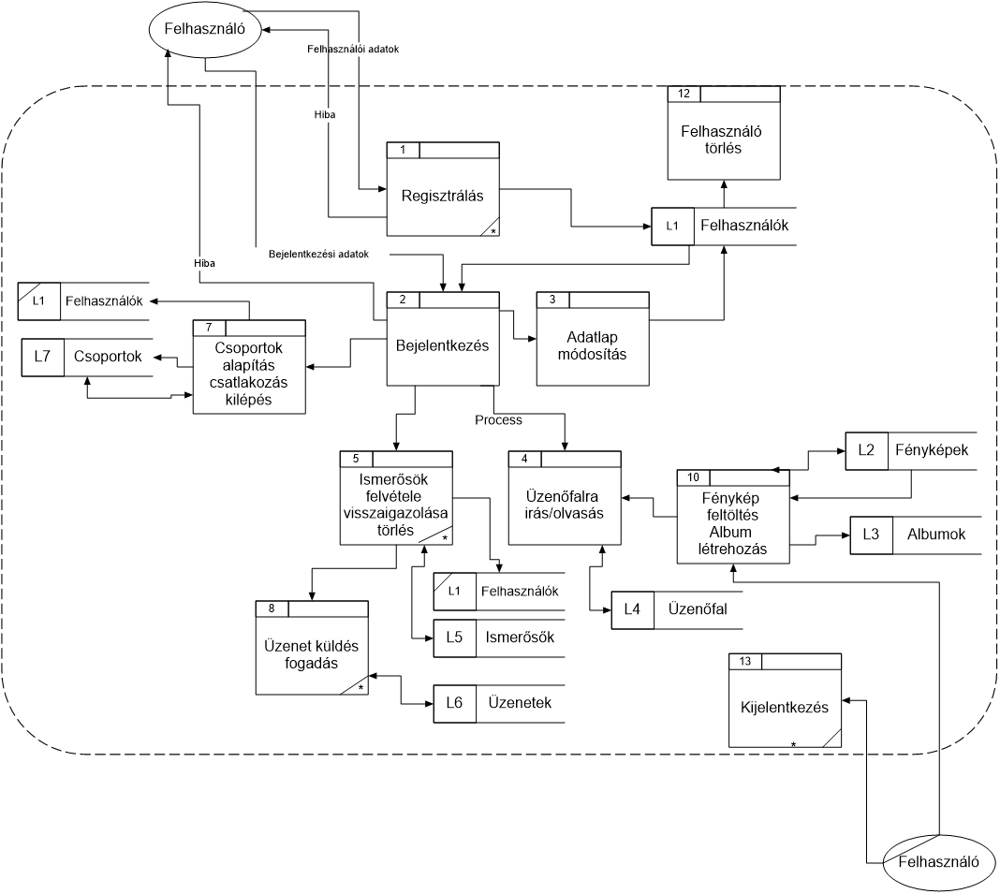
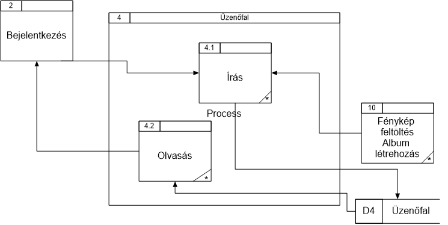
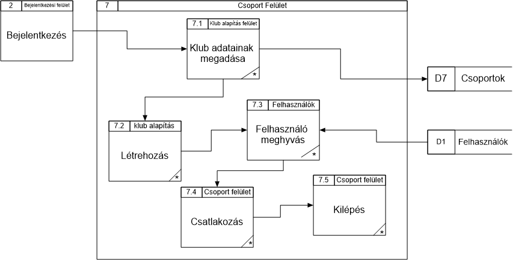
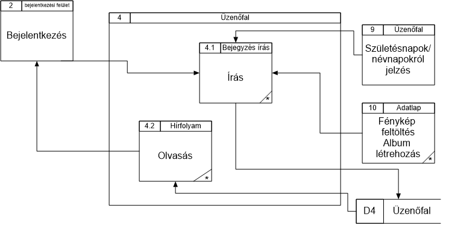
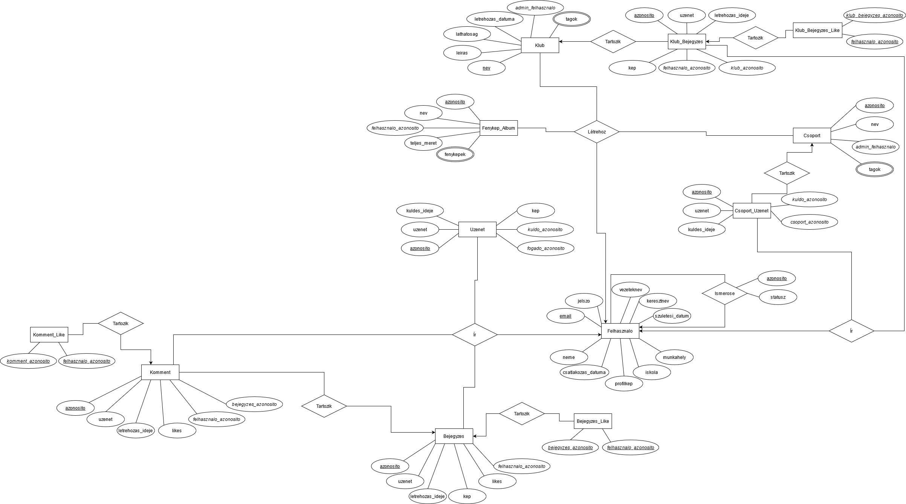

# `KÖZÖSSÉGI OLDAL` Projektterv 2021

## 1. Összefoglaló 
A projektünk témája egy közösségi oldal elkészítése, ahol az emberek a mindennapi életük fontosabb pontjait tudják megosztani ismerőseikkel, barátaikkal. Figyelemmel tudják követni egymás tevékenységeit, akár ezzel kapcsolatos reakcióikat is kifejezhetik, vagy éppen társaloghatnak is egymással. Célja, hogy megkönnyítse az embereknek a távolabbi ismerőseik elérését, ugyanakkor, hogy megerősítse a közelebbi barátaikkal lévő kapcsolatukat. A mai világban egy-egy hír, kifejezetten nagy jelentőséggel bír, amihez elengedhetetlen, egy hasonló oldal, ami képes felvenni a versenyt ezzel a száguldó társadalommal.

## 2. A projekt bemutatása
Ez a projektterv a `KÖZÖSSÉGI OLDAL` projektet mutatja be, mely 2021-02-16-tól 2021-05-07-ig tart. A projektet egy 3 fős csapat keretein belül kell elkészítenünk, amit a megrendelő felé 3 alkalman keresztül kell bemutatnunk és elkészítenünk.

### 2.1. Rendszerspecifikáció

### 2.1.1 Funkcionális követelmények
- Felhasználók regisztrálása, profilok létrehozása
- Fényképek feltöltése, megjegyzés hozzáfűzése
- Ismerősök bejelölése, ismeretség visszaigazolása
- Üzenet küldése ismerősöknek
- Klubok, csoportok alapítása
- Klubok tagjainak létszáma
- Ismeretlen tagok ajánlása ismerősnek közös ismerősök alapján
- Névnaposok, születésnaposok az adott hónapban
- Klubok ajánlása, ahol van közös ismerős
- Ismerősök ajánlása munkahely, vagy iskola alapján
- Üzenetek küldése, fogadása
- Üzenetek kiírása üzenőfalra, válaszolás üzenőfalra írt üzenetre
- Fényképalbumok létrehozása, albumjellemzők (fényképek száma, felhasznált tárhely)
- Meghívások kezelése, statisztika a meghívásokról (kinek hány olyan ismerőse van, akit ő hívott meg) 

### 2.1.2 Nem funkcionális követelmények
- Támogatott böngészők: Chrome, Opera, Firefox, Brave, Edge. (legfrissebb verzió)
- Adatbázis válaszidő kevesebb mint 300ms.
- AJAX frissítés.

## 3. Szervezeti felépítés és felelősségmegosztás
A projekt megrendelője Körmöczi László Ádám. A `KÖZÖSSÉGI OLDAL` projektet a következő projektcsapat fogja végrehajtani:

### 3.1 Projektcsapat
A projekt a következő emberekből áll:

|                                            |         Név         |        E-mail cím      |
|:------------------------------------------:|:-------------------:|:---------------------: |
|                 Projekt tag                | Kovács Soma Kristóf |kovacssoma2000@gmail.com|
|                 Projekt tag                |Lublóváry György Máté| lubigyurma@gmail.com   |
|                 Projekt tag                |      Cseri Gábor    | cserigabi4@gmail.com   |

## 4. A munka feltételei
### 4.1. Munkakörnyezet
A projekt a következő munkaállomásokat fogja használni a munka során:
 - LENOVO LEGION Y530 (Intel i7-8750H, 16 GB RAM, NVIDIA GTX 1050 Ti, Windows 10 Pro) - VS CODE, PHPStorm, Docker, SQL Developer, XAMPP
 - Számítógép (Ryzen 7 3800, 16 GB RAM, NVIDIA GTX 1030, Linux) - VS CODE, PHPStorm, Docker, SQL Developer, XAMPP
 - MSI GF63 Thin 8SC(Intel i7-8750H, 8 GB RAM, MSI GTX 1650 , Windows 10) - VS CODE, PHPStorm, Docker, SQL Developer, XAMPP

## 5. A munka tartalma
### 5.1. Tervezett szoftverfolyamat modell és architektúra
A csapat a SCRUM Model-lel tervezi a munkafolyamatokat megvalósítani. A projekt logikai szinten PHP-ban az MVC modellt követve fog elkészülni, amihez a GUI-t HTML/CSS/Javascript-tel fogjuk elkészíteni, és Oracle adatbázist fogunk használni.

### 5.2. Átadandók és határidők
A főbb átadandók és határidők a projekt időtartama alatt a következők:

D - dokumentáció, P - prototíus

| Szállítandó |                           Neve                           |   Határideje  |
|:-----------:|:--------------------------------------------------------:|:-------------:|
|      D1     |        Dokumentáció és adatbázisterv bemutatása          |   2021-03-30  |
|      D2     |        Adatbázist létrehozó szkriptek bemutatása         |   2021-04-11  |
|    P1+D3    |   Adatlekérés bemutatása grafikus felhasználói felületen |   2021-04-27  |
|    P2+D4    |  Adatfelvitel bemutatása grafikus felhasználói felületen |   2021-05-04  |
|    P3+D5    |                      Projektátadás                       |   2021-05-07  |

## 6. Feladatlista

A `KÖZÖSSÉGI OLDAL projekt 2021. február 16-án` indult. A következőkben a tervezett feladatok részletes összefoglalása található:

### 6.1. Dokumentáció (1. mérföldkő)
Ennek a feladatnak az a célja, hogy bemutassa a dokumentációt és a hozzájuk tartozó adatbázisterveket.

#### 6.1.1. Logikai adatfolyam diagram 1.szintű

#### 6.1.2. Logikai adatfolyam diagram 2.szintű
##### 6.1.2.1. Bejelentkezés

##### 6.1.2.2. Csoportok

##### 6.1.2.3. Képfeltöltés

##### 6.1.2.4. Üzenőfal

#### 6.1.3. Fizikai adatfolyam diagram 1. szintű

#### 6.1.4. Fizikai adatfolyam diagram 2. szintű
##### 6.1.4.1. Bejelentkezés

##### 6.1.4.2. Csoportok

##### 6.1.4.3. Képfeltöltés

##### 6.1.4.4. Üzenőfal

#### 6.1.5. Egyedmodell

#### 6.1.6. Relációs adatelemzés
##### 6.1.6.1. Egyed-Kapcsolat Diagram:

##### 6.1.6.2. Relációs adatmodell:
FELHASZNALO(**email**, jelszo, vezeteknev, keresztnev, szuletesi_datum, neme, iskola, munkahely, csatlakozas_datuma, profilkep)  
FENYKEP_ALBUM(**azonosito**, nev, teljes_meret, *felhasznalo_azonosito*)  
FENYKEPEK(**azonosito**, kep, meret, *fenykep_album_azonosito*)  
ISMEROS (**azonosito**, statusz, *felhasznalo1*, *felhasznalo2*)   
BEJEGYZÉS(**azonosito**, uzenet, letrehozas_ideje, kep, likes, *felhasznalo_azonosito*)  
BEJEGYZÉS_LIKE(***bejegyzes_azonossito***, ***felhasznalo_azonosito***)  
KOMMENT(**azonosito**, uzenet, letrehozas_ideje, likes, *felhasznalo_azonosito*, *bejegyzes_azonosito*)  
KOMMENT_LIKE(***komment_azonosito***, ***felhasznalo_azonosito***)  
CSOPORT(**azonosito**, nev, *admin_felhasznalo*)  
CSOPORT_TAGOK(***csoport_azonosito***, ***felhasznalo_azonosito***)  
UZENET(**azonosito**, uzenet, kuldes_ideje, kep, *kuldo_azonosito*, *fogado_azonosito*)  
CSOPORT_UZENET(**azonosito**, uzenet, kuldes_ideje, *kuldo_azonosito*, *csoport_azonosito*)  
KLUB(**nev**, leiras, lathatosag, letrehozas_datuma, *admin_felhasznalo*)  
KLUB_TAGOK (***klub_azonosito***, ***felhasznalo_azonosito***)  
KLUB_BEJEGYZES(**azonosito**, uzenet, letrehozas_ideje, kep, *felhasznalo_azonosito*, *klub_azonosito*)  
KLUB_BEJEGYZES_LIKE(***klub_bejegyzes_azonosito***, ***felhasznalo_azonosito***)  

##### 6.1.6.3. Normalizálás: 
- **1NF**: A leképezés után összetett attribútum nincs, csak a FENYKEP_ALBUM táblában lévő fenykepek, és a CSOPORT és a KLUB táblákban maradt tagok maradt többértékű attribútum, ehhez fel kell vennünk egy új relációs sémát, amihez külső kulcsként hozzávesszük az őt tartalmazó relációséma kulcsát. Így, teljesül az NF1.
- **2NF**: Az egyedekből leképezett sémákra triviálisan teljesül, mert minden kulcsuk egyelemű. A BEJEGYZÉS LIKE, a KOMMENT LIKE, CSOPORT_TAGOK, KLUB_TAGOK és a KLUB_BEJEGYZES_LIKE sémákban is triviálisan teljesül, mert nincs bennük másodlagos attribútum. Az IMSEROS sémában a statusz nyilvánvalóan teljesen függ a kulcstól. Tehát a sémák 2NF-ben vannak.
- **3NF**: Mindegyik séma 3NF-ban van, mert mindegyik másodlagos attribútum közvetlenül függ a kulcstól.

#### 6.1.7. Funkció meghatározás
##### 6.1.7.1. Regisztráció

##### 6.1.7.2. Bejelentkezés

##### 6.1.7.3. Adatlapmódosítás

##### 6.1.7.4. Ismerősök kezelése

##### 6.1.7.5. Fényképek és albumok

##### 6.1.7.6. Klubok

##### 6.1.7.7. Üzenőfal

##### 6.1.7.8. Üzenet

##### 6.1.7.9. Felhasználó törlése

##### 6.1.7.10. Bejegyzés törlése

##### 6.1.7.11. Születésnapok

##### 6.1.7.12. Meghívás

##### 6.1.7.13. Kijelentkezés

#### 6.1.8. Egyed-esemény mátrix

#### 6.1.9. Szerep-funkció mátrix

#### 6.1.10. Képrenyőtervek
##### 6.1.10.1. Regisztráció

##### 6.1.10.2. Bejelentkezés

##### 6.1.10.3. Üzenőfal

##### 6.1.10.4. Profil

##### 6.1.10.5. Üzenetek

#### 6.1.11. Menütervek

### 6.2. Prototípus I. (2. mérföldkő)
Ennek a feladatnak az a célja, hogy bemutassa az I. prototípusig vezető utat, annak fontosabb funkcióit. Mindezt egy grafikus felületen megvalósítva, az adatbázissal való komunikációt bemutassa.

Részfeladatai a következők:

#### 6.2.1. Header Frontend

#### 6.2.2. Footer Frontend
Minimalista, fekete háttéren a copyright szöveg.

#### 6.2.3. Regisztráció Frontend

#### 6.2.4. Bejelentkezés Frontend

#### 6.2.5. Üzenőfal Frontend

#### 6.2.6. Profil Page Frontend

#### 6.2.7. Üzenetek Frontend

#### 6.2.8. Klubbok Frontend

#### 6.2.9. Validálás és beléptetés
##### 6.2.9.1. Regisztráció esetén
1. Az összes mező kitöltése megtörtént
2. Nem megfelelő email cím ellenőrzése
3. Már létező email cím ellenőrzése
4. Nem egyező jelszavak ellenőrzése
5. Hibaüzenetek mindhez
6. Siker esetén felhasználó tájékoztatésa

##### 6.2.9.2. Bejelentkezés esetén
1. Az összes mező kitöltése megtörtént
2. Nem létező email cím ellenőrzése
3. Nem megfelelő jelszó
4. Hibaüzenetek mindhez

#### 6.2.10. Üzenőfal Backend I.
1. A bejelentkezett felhasználó megjelenítése, a megfelelő adatokkal
2. Bejegyzés közzététel
3. Likeolás megvalósítása
4. Összes bejegyzés listázása
5. Kommentek listázása
6. Bejegyzéshez képfeltöltés

#### 6.2.11. Profil Page Backend I.
1. A bejelentkezett felhasználó megjelenítése, a megfelelő adatokkal
2. Bejegyzés közzététel
3. Adatainak módosítása
4. Profilképcsere
5. Likeolás megvalósítása
6. Saját bejegyzéseink listázása
7. Kommentek listázása
8. Bejegyzéshez képfeltöltés

#### 6.2.12. Üzenetek Backend I.
1. A bejelentkezett felhasználó megjelenítése, a megfelelő adatokkal
2. Az adott felhasználó barátainak a listázása

#### 6.2.13. Klubbok Backend I.
1. Klubok listázása 

#### 6.2.14. Ismerősök kezelése
1. Ismerősnek jelölés megvalósítása
2. Ismerős kérelem elutasítása
3. Ismerős kérelem elfogadása
4. Ismerős törlése, ha már ismerősök vagytok
5. Ismertség jelzése a felhasználó felé

### 6.3. Prototípus II. (3. mérföldkő)
Ennek a feladatnak az a célja, hogy bemutassa az elkészült projektet.

Részfeladatai a következők:

#### 6.3.1. TODO: Elkészítés
Leírás

#### 6.3.1. TODO: Elkészítés
Leírás

#### 6.3.1. TODO: Elkészítés
Leírás

#### 6.3.1. TODO: Elkészítés
Leírás

#### 6.3.1. TODO: Elkészítés
Leírás

Szeged, 2021-03-18.
